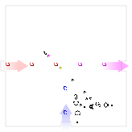

# Verified compilation into Conway's Game of Life

The following inspired this work:

 - Nicolas Loizeau: https://www.nicolasloizeau.com/gol-computer
   and https://www.youtube.com/watch?v=Kk2MH9O4pXY&t=930

 - Nicholas Carlini:
   https://nicholas.carlini.com/writing/2021/improved-logic-gates-game-of-life.html

To build the project:

* Install [HOL](https://hol-theorem-prover.org/)
* Run `Holmake` from the project directory

Points of interest:

* [`gol_rulesScript.sml`](./gol_rulesScript.sml) has the definition of
  the GOL next-state function `step`

* [`gol_in_gol_circuitScript.sml`](./gol_in_gol_circuitScript.sml)
  has the main theorem `gol_in_gol_circuit_thm`

* The gate designs are in [`gates/`](./gates), in RLE format (which is
  supported by [Golly](https://golly.sourceforge.io/) - useful if you
  want to play with the gates outside the context of this formalization)

* The mega-cell design is in
  [`gol_in_gol_paramsLib.sml`](./gol_in_gol_paramsLib.sml), as an ASCII
  art diagram that is parsed and verified in
  [`gol_in_gol_circuitScript.sml`](./gol_in_gol_circuitScript.sml).

It should take about 2-5 minutes to compile the project.

## Some pretty pictures that couldn't all fit in the paper

* The mega-cell:
  

* Propagation of values through the mega-cell:
  

* Symbolic evaluation of an AND gate:
  

* Symbolic evaluation of a crossover:
  

* Symbolic evaluation of a half-adder:
  

* Composition of gates:
  

* Spaceship evolution:
  

The tools for creating these images are in [`gol_svgScript.sml`](./gol_svgScript.sml), so you can modify them to e.g. see images of the rest of the gates or show other patterns, etc.

There is also a simulator at [`ts/gol.html`](ts/gol.html) which you can use to see the symbolic computation in action. Hover over the pixels to see the values assigned at each point.
